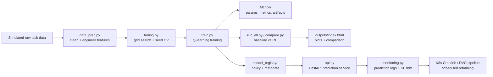

# Smart Energy Management RL - MLOps Edition

This project trains a Q-learning agent to manage power levels for a battery
powered IoT device. The agent observes battery state and task demand, then
chooses low, medium, or high power to maximize task success while conserving
energy.

The repository now implements the full rubric pipeline: data preparation,
feature engineering, multiple policies, hyperparameter tuning, seed-based
cross-validation, MLflow tracking, reproducible scripts, Docker/FastAPI
serving, prediction and drift monitoring, CI, DVC, and GitOps manifests.

## Architecture



## What Is Implemented

| Rubric area | Implementation |
|---|---|
| Data preparation | `data_prep.py` generates raw task data, removes invalid rows, clips battery percentages, and creates engineered features such as `battery_bucket`, `task_demand_id`, and `is_high_demand`. |
| Model development | `agent.py`, `baseline.py`, and `train.py` implement fixed baseline and tabular Q-learning policies. |
| Evaluation | `compare.py` and `run_all.py` compare baseline vs RL, generate reward/battery plots, and produce `outputs/index.html`. |
| Hyperparameter tuning | `tuning.py` runs grid search over learning rate, gamma, and epsilon decay with seed-based cross-validation. |
| Tracking | `train.py` writes `results.csv`, per-episode JSON logs, MLflow runs, and local registry metadata. |
| CI/CD | `.github/workflows/ci.yml` runs tests, data prep, training smoke test, and API health check. |
| Docker + API | `Dockerfile`, `docker-compose.yml`, and `api.py` run the pipeline and expose `/health`, `/predict`, and `/monitoring/drift`. |
| Monitoring | `monitoring.py` logs predictions and computes KL-divergence drift against the training demand distribution. |
| GitOps | `k8s/` contains ConfigMap, Deployment, Service, and retraining CronJob manifests. |
| Versioning | `dvc.yaml` defines prepare, tune, train, and evaluate stages. Policies are registered under `model_registry/`. |
| Collaboration | PR template and issue templates support branching, reviews, and issue tracking. |

## Setup

Use Python 3.11 or newer.

```bash
pip install -r requirements.txt
```

If `python` is not on PATH in this Codex desktop environment, the bundled
runtime used during verification was:

```powershell
& "C:\Users\Shreyas B Joshi\.cache\codex-runtimes\codex-primary-runtime\dependencies\python\python.exe" -m pip install -r requirements.txt
```

## Run The Full Pipeline

```bash
python data_prep.py --rows 300 --seed 42
python tuning.py --train_episodes 250 --eval_episodes 80
python train.py --config configs/qlearning_v1.yaml --run_id run_v1
python train.py --config configs/qlearning_v2.yaml --run_id run_v2
python run_all.py --load_policy policy_v1.pkl --eval_episodes 200
```

Main outputs:

- `data/clean_tasks.csv`
- `outputs/tuning_results.csv`
- `outputs/best_hyperparameters.json`
- `results.csv`
- `logs/<run_id>.json`
- `mlruns/`
- `model_registry/<version>/metadata.json`
- `outputs/index.html`

## Serve The Model

Start the API locally:

```bash
uvicorn api:app --host 127.0.0.1 --port 8000
```

Example prediction:

```bash
curl -X POST http://127.0.0.1:8000/predict ^
  -H "Content-Type: application/json" ^
  -d "{\"battery_pct\":72,\"task_demand\":\"high\"}"
```

Drift endpoint:

```bash
curl http://127.0.0.1:8000/monitoring/drift
```

## Docker Compose

```bash
docker-compose up --build
```

Services:

- `pipeline`: runs the training/evaluation/report pipeline.
- `api`: trains a boot policy if needed, then serves FastAPI on port `8000`.

## DVC Workflow

```bash
dvc repro
```

Stages in `dvc.yaml`:

- `prepare`: generate and clean task data.
- `tune`: run hyperparameter search.
- `train`: train the tuned policy.
- `evaluate`: generate report, plots, and comparison table.

## GitOps / Kubernetes

Apply manifests from `k8s/`:

```bash
kubectl apply -f k8s/configmap.yaml
kubectl apply -f k8s/deployment.yaml
kubectl apply -f k8s/service.yaml
kubectl apply -f k8s/retrain-cronjob.yaml
```

The deployment exposes the API, while the CronJob runs weekly retraining.

## Tests

```bash
pytest -q
```

The tests cover agent policy shape, data preparation, drift detection, and API
health.

## Branching And Collaboration

Recommended workflow:

- `main`: stable submission branch.
- `dev`: integration branch.
- `feature/<short-name>`: feature work such as `feature/api-monitoring`.

Use pull requests into `dev`, require at least one review, and attach generated
metrics or screenshots from `outputs/index.html` when model behavior changes.
Issue templates and the PR template are under `.github/`.

## Demo Script

1. Show `data_prep.py` and `data/clean_tasks.csv` for cleaning and feature engineering.
2. Run `pytest -q` to show automated checks.
3. Run `python train.py --config configs/qlearning_v1.yaml --run_id demo`.
4. Show the new row in `results.csv`, `logs/demo.json`, `mlruns/`, and `model_registry/`.
5. Run `python run_all.py --load_policy policy_v1.pkl --eval_episodes 200`.
6. Open `outputs/index.html` and explain the reward and battery plots.
7. Start `uvicorn api:app --host 127.0.0.1 --port 8000`, call `/predict`, then call `/monitoring/drift`.
8. Show `.github/workflows/ci.yml`, `dvc.yaml`, and `k8s/` for automation and scalability.
