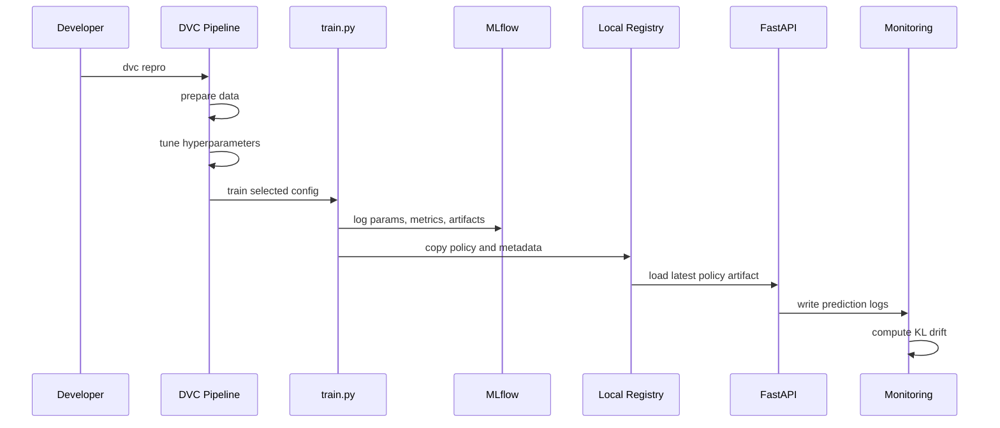

# Architecture

The system is intentionally small but production-shaped: a deterministic
simulator provides reproducible training, the policy is tracked and registered,
the API serves predictions, and monitoring logs evidence for drift-triggered
retraining.
